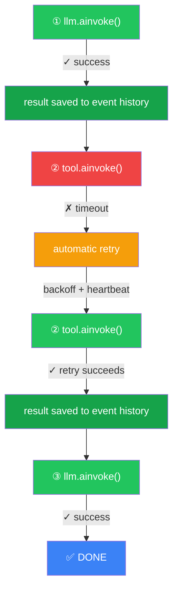

<div align="center">

<h1>duralang</h1>

<p><strong>Agents that cannot fail. One decorator.</strong></p>

<p>
<code>duralang</code> is the missing durability layer for LangChain.<br>
Write the same LangChain code you already know — add <code>@dura</code> — and every LLM call,<br> tool call, MCP call, and agent-to-agent call becomes individually recoverable,<br> automatically retried, and fully observable through Temporal.
</p>

<p><strong>No new framework. No graph DSL. No code rewrite. Just durability.</strong></p>

[](https://pypi.org/project/duralang/)
[](https://python.org)
[](LICENSE)
[](https://temporal.io)

</div>

---

## The Problem

**Most AI agent failures are infrastructure failures, not intelligence failures.**

The model picked the right tool. The reasoning was correct. But a network timeout at minute 47 of a 60-minute run killed the entire pipeline — and you lost every completed step along with it.

**Modern AI agents are stochastic systems.**  
The LLM decides the execution path at runtime — what tools to call, in what order, and how many times.

**But durability frameworks assume deterministic workflows.**  
They expect predefined graphs, fixed execution paths, and known structure ahead of time.

**The result:** stochastic agent workflows today have **no native durability model.**

---

This is the reality of production agent systems today:

- **LangChain** gives you the best composability layer for LLM applications. But it does **not** provide built-in durability for long-running agent execution. If a call fails mid-run, execution typically fails unless you add your own recovery logic. Framework-level durable state persistence, checkpointed resume, and centralized retry/timeout policy management are not built in.

- **LangGraph** solves this with graph-based checkpointing. But it requires restructuring your code into explicit nodes and edges. Free-form agent loops — where the LLM decides what to call, in what order, how many times — don't map cleanly to static graphs. You end up choosing between graph complexity or coarse checkpoints that don't protect individual operations.

- **Temporal** is the gold standard for durable execution. But using it with LLM agents requires you to manually define workflows, activities, serialization boundaries, and retry policies for every operation. It's powerful but high-ceremony — the opposite of what you want when iterating on agent logic.

**The gap:** there is no way to take an existing LangChain agent and make it durable without rewriting it.

**duralang fills that gap.**

---

## The Solution

```python
from duralang import dura, dura_agent  # ← only new imports

@dura                       # ← only code change
async def my_agent(messages):
    agent = dura_agent(
        model="claude-sonnet-4-6",
        tools=[TavilySearchResults(), calculator],
    )
    result = await agent.ainvoke({"messages": messages})  # LLM + tool calls → Temporal Activities
    return result["messages"]
```

**That's it.** The code above is identical to standard LangChain — except it cannot fail permanently. Every LLM call and tool call inside `dura_agent` is now a durable Temporal Activity — automatically retried, heartbeated, and recorded in Temporal's event history.

> **The LLM is stochastic and decides everything.**
> duralang does not change that.
> It just makes sure whatever the LLM decides to do cannot fail permanently.
>
> **Nondeterminism in the model. Durability in Temporal.**

---

## What Happens When Something Fails



**Only the failed operation retries.** On recovery, Temporal replays the workflow logic from the beginning — but completed steps return their stored results instantly (no API calls re-made). No wasted money. No lost progress.

### Process Crash Recovery

If the entire worker process dies (OOM, hardware failure, deployment), Temporal still holds the workflow. Restart the process, and execution resumes from the exact point of failure:

```bash
# First run — crashes at step 4
python examples/crash_recovery.py --crash
# Process killed ☠️

# Second run — Temporal replays event history, steps 1-3 NOT re-executed
python examples/crash_recovery.py --crash
# ✓ Completed (no LLM calls re-made, no money wasted)
```

See [`crash_recovery.py`](examples/crash_recovery.py) for the full working demo.

---

## Features

### 🧭 Durable Agent Workflows

The model decides the path at runtime, and **every chosen step is durable.** No predefined graph. Whatever branch the LLM takes is recorded in Temporal's event history.

```python
@dura
async def research_agent(messages):
    agent = dura_agent(
        model="claude-sonnet-4-6",
        tools=[web_search, calculator],
    )
    result = await agent.ainvoke({"messages": messages})  # every call → durable
    return result["messages"]
```

**Scale it up** — pass `@dura` functions directly as tools to `dura_agent()`, and you get durable multi-agent systems with the same pattern:

```python
from duralang import dura, dura_agent

all_tools = [
    researcher,    # @dura → Child Workflow (auto-wrapped by dura_agent)
    analyst,       # @dura → Child Workflow (auto-wrapped by dura_agent)
    calculator,    # @tool → dura__tool Activity (auto-wrapped by dura_agent)
]

@dura
async def orchestrator(task: str) -> str:
    agent = dura_agent(
        model="claude-sonnet-4-6",
        tools=all_tools,  # mix agents + tools freely
    )
    result = await agent.ainvoke({"messages": [HumanMessage(content=task)]})
    return result["messages"][-1].content
```

Each sub-agent runs as an independent durable unit with its own event history. If the analyst crashes, **only the analyst retries** — the researcher's completed work is preserved.

```
orchestrator
├── llm.ainvoke()                       ← durable
├── researcher (independent sub-agent)
│    ├── llm.ainvoke()                  ← durable
│    └── web_search.ainvoke()           ← durable
├── analyst (independent sub-agent)
│    ├── llm.ainvoke()                  ← durable
│    └── calculator.ainvoke()           ← durable
└── llm.ainvoke()                       ← durable
```

Nesting works to any depth. You can also call `@dura` functions directly — the decorator detects the context and routes as a child workflow automatically.

---

### 🔍 Free, Built-in Observability

Every execution is fully inspectable in the **Temporal UI** at `http://localhost:8233` — no paid services, no SDK integration, no extra code:

- **Per-call timeline:** Every LLM call, tool call, and agent call with inputs, outputs, latency, and attempt count
- **Retry history:** Exactly which calls failed, when, and how many attempts were needed
- **Workflow hierarchy:** Parent → child agent nesting visible as a tree
- **Full event history:** See the complete durable state after each operation
- **Replayable:** Temporal's event history is a deterministic record of the entire execution

> **No equivalent exists for free.** LangSmith charges per trace. OpenTelemetry requires setup and a backend. With duralang, observability is automatic — every `@dura` function is fully traced in the Temporal UI with zero configuration.

---

### 🧱 Durability Stack

Every operation gets the full durability stack automatically:

| Layer | What It Does | Default |
|---|---|---|
| **Retries** | Exponential backoff on transient failures | 3 attempts, 2× backoff |
| **Timeouts** | Bounded execution per operation | 10 min (LLM), 2 min (tool), 5 min (MCP) |
| **Heartbeating** | Detects hung operations (distinguishes "still thinking" from "stuck") | 5 min (LLM), 30s (tool/MCP) |
| **State** | Every step outcome recorded in event history | Automatic — enables deterministic replay |

Non-retryable errors (e.g., `ValueError`, `TypeError`) fail immediately. Transient errors (timeouts, rate limits, network failures) are retried automatically.

All defaults are configurable:

```python
from datetime import timedelta
from temporalio.common import RetryPolicy
from duralang import dura, DuraConfig, ActivityConfig

config = DuraConfig(
    task_queue="agents-prod",
    llm_config=ActivityConfig(
        start_to_close_timeout=timedelta(minutes=3),
        heartbeat_timeout=timedelta(seconds=30),
        retry_policy=RetryPolicy(maximum_attempts=5),
    ),
    tool_config=ActivityConfig(
        start_to_close_timeout=timedelta(minutes=1),
        retry_policy=RetryPolicy(maximum_attempts=4),
    ),
)

@dura(config=config)
async def my_agent(messages):
    ...
```

---

### 🌐 Model-Agnostic

duralang works with any LangChain-compatible `BaseChatModel`. Same code, any provider:

| Provider | Class | Status |
|---|---|---|
| Anthropic | `ChatAnthropic` | ✅ Supported |
| OpenAI | `ChatOpenAI` | ✅ Supported |
| Google | `ChatGoogleGenerativeAI` | ✅ Supported |
| Ollama | `ChatOllama` | ✅ Supported |

Switch providers by changing one line. duralang automatically detects the provider and handles everything needed to make it durable.

---

### ⚡ Parallel Tool Execution

When the LLM returns multiple tool calls, `dura_agent` executes them in parallel automatically. Each call becomes its own durable Temporal Activity:

```python
@dura
async def my_agent(messages):
    agent = dura_agent(
        model="claude-sonnet-4-6",
        tools=[get_weather, get_time, calculator],  # multiple tools available
    )
    # Parallel tool calls handled internally — each is independently durable
    result = await agent.ainvoke({"messages": messages})
    return result["messages"]
```

---

### 🕸️ Native MCP Support

MCP (Model Context Protocol) servers are first-class citizens. Use [`langchain-mcp-adapters`](https://github.com/langchain-ai/langchain-mcp-adapters) to convert MCP tools into standard LangChain tools, then pass them to `dura_agent()` -- every call becomes durable automatically:

```python
from langchain_mcp_adapters.client import MultiServerMCPClient
from duralang import dura, dura_agent

client = MultiServerMCPClient({
    "filesystem": {
        "transport": "stdio",
        "command": "npx",
        "args": ["-y", "@modelcontextprotocol/server-filesystem", "/tmp"],
    },
})
tools = await client.get_tools()

@dura
async def my_agent(messages):
    agent = dura_agent("claude-sonnet-4-6", tools=tools)
    result = await agent.ainvoke({"messages": messages})
    return result["messages"]
```

---

## Compared to Alternatives

**duralang vs LangGraph** — they solve different problems:

| | LangGraph | duralang |
|---|---|---|
| **Execution** | Graph nodes + edges | Free-form async loops |
| **Durability** | Per-node checkpoint (snapshot) | Per-operation event history (replay) |
| **Code change** | Restructure into graph | Add `@dura` |
| **Recovery** | Re-execute entire node | Retry only the failed call |
| **Best for** | Known workflow topology | Stochastic, LLM-driven loops |

**duralang vs Temporal directly** — duralang is built on Temporal, but eliminates the boilerplate: no manual workflow/activity definitions, no custom serializers, no worker lifecycle management. You get Temporal's full power behind `@dura`.

---

## How It Works

You write normal LangChain code. duralang intercepts it transparently.

`dura_agent()` wraps your model and tools with durable subclasses (`DuraModel`, `DuraTool`) that check for `DuraContext` on every call. Inside a `@dura` function, those calls are routed to Temporal. Outside `@dura`, they pass through to the original LangChain implementation.

```python
@dura
async def my_agent(messages):
    agent = dura_agent(                                      # durable agent creation
        model="claude-sonnet-4-6",
        tools=[web_search, calculator],
    )
    result = await agent.ainvoke({"messages": messages})    # ← internal calls intercepted, durable
    return result["messages"]
```

That's the entire mental model:

- **`@dura`** on your function → makes it a Temporal Workflow
- **LLM and tool calls inside** → each becomes a retryable Temporal Activity with its outcome recorded in event history
- **`@dura` calling `@dura`** → becomes a Child Workflow with its own state
- **Remove `@dura`** → everything runs as vanilla LangChain

For the full architecture (proxy mechanism, serialization, activity internals), see [Architecture](docs/architecture.md).

---

## Quickstart

### 1. Install duralang

```bash
pip install duralang
```

With a specific LLM provider:

```bash
pip install "duralang[anthropic]"   # or openai, google, ollama, all-models
```

### 2. Start Temporal

duralang requires a running Temporal server. Fastest setup via [Temporal CLI](https://docs.temporal.io/cli):

```bash
# Install Temporal CLI (macOS)
brew install temporal

# Start the development server (includes UI at localhost:8233)
temporal server start-dev
```

### 3. Write your agent

```python
import asyncio
from langchain_community.tools.tavily_search import TavilySearchResults
from langchain_core.messages import HumanMessage
from duralang import dura, dura_agent

@dura
async def research_agent(messages: list) -> list:
    agent = dura_agent(
        model="claude-sonnet-4-6",
        tools=[TavilySearchResults(max_results=3)],
    )
    result = await agent.ainvoke({"messages": messages})
    return result["messages"]

async def main():
    result = await research_agent([HumanMessage(content="What is the weather in NYC?")])
    print(result[-1].content)

asyncio.run(main())
```

### 4. Inspect in Temporal UI

Open `http://localhost:8233` to see the full execution timeline — every LLM call, tool call, retry, latency, and input/output payload.

---

## Examples

The [`examples/`](examples/) directory contains runnable demos:

| Example | What It Shows |
|---|---|
| [`basic_agent.py`](examples/basic_agent.py) | Standard LangChain agent with `@dura` |
| [`multi_tool.py`](examples/multi_tool.py) | Parallel tool execution with `asyncio.gather` |
| [`multi_model.py`](examples/multi_model.py) | Same agent code with different LLM providers |
| [`multiagent_system.py`](examples/multiagent_system.py) | Multi-agent orchestrator with mixed agent/tool dispatch |
| [`sequential_agents.py`](examples/sequential_agents.py) | Sequential pipeline: research → analyze → write |
| [`mcp_agent.py`](examples/mcp_agent.py) | MCP filesystem server with `langchain-mcp-adapters` |
| [`crash_recovery.py`](examples/crash_recovery.py) | Automatic retry + process crash recovery demo |
| [`human_in_loop.py`](examples/human_in_loop.py) | Human-in-the-loop pattern (v2 preview) |

---

## Architecture

```
duralang/
├── __init__.py              # Exports: dura, dura_agent, DuraConfig
├── decorator.py             # @dura — the entire public API
├── dura_agent.py            # dura_agent() — wraps model+tools for durable dispatch
├── dura_model.py            # DuraModel — BaseChatModel subclass for durable LLM calls
├── dura_tool.py             # DuraTool — BaseTool subclass for durable tool calls
├── agent_tool.py            # dura_agent_tool() — wraps @dura as BaseTool (internal)
├── proxy.py                 # DuraMCPProxy (legacy — prefer langchain-mcp-adapters)
├── context.py               # DuraContext — ContextVar-based workflow context
├── workflow.py              # DuraLangWorkflow — Temporal workflow definition
├── runner.py                # DuraRunner — Temporal client + worker lifecycle
├── activities/
│   ├── llm.py               # dura__llm — LLM inference activity
│   ├── tool.py              # dura__tool — tool execution activity
│   └── mcp.py               # dura__mcp — MCP call activity (legacy)
├── graph_def.py             # Payload/Result dataclasses for Temporal
├── state.py                 # MessageSerializer + ArgSerializer
├── config.py                # DuraConfig, ActivityConfig, LLMIdentity
├── registry.py              # ToolRegistry, MCPSessionRegistry
├── exceptions.py            # Exception hierarchy
└── cli.py                   # duralang CLI (worker management)
```

---

## API Reference

### `@dura`

The primary public API. Decorates an async function to make it durable.

```python
@dura
async def my_agent(messages): ...

@dura(config=DuraConfig(...))
async def my_agent(messages): ...
```

- Supports `@dura` (no parentheses) and `@dura(config=...)` (with config)
- Functions must be `async`, module-level, and importable
- When called from within another `@dura` function → becomes a Child Workflow
- When called from normal code → starts a new Temporal Workflow

### `dura_agent(model, tools, **kwargs)`

Factory that wraps a model and tools for durable dispatch via LangChain's `create_agent`.

```python
agent = dura_agent(
    model="claude-sonnet-4-6",          # string or BaseChatModel
    tools=[web_search, researcher],      # mix @tool, @dura, BaseTool freely
)
```

- Wraps the model with `DuraModel` (routes `ainvoke` through `dura__llm` Activity)
- Wraps tools with `DuraTool` (routes through `dura__tool` Activity)
- `@dura` functions passed as tools are auto-wrapped as agent tools (→ Child Workflow)
- Returns a standard LangChain agent — use `agent.ainvoke({"messages": ...})`

### MCP Integration

Use `langchain-mcp-adapters` to convert MCP tools into LangChain tools, then pass to `dura_agent()`:

```python
from langchain_mcp_adapters.client import MultiServerMCPClient
tools = await MultiServerMCPClient({...}).get_tools()
agent = dura_agent("claude-sonnet-4-6", tools=tools)
```

> `DuraMCPSession` is still available for legacy use. See [API Reference](docs/api-reference.md) for details.

### `DuraConfig`

Top-level configuration.

```python
config = DuraConfig(
    temporal_host="localhost:7233",
    temporal_namespace="default",
    task_queue="duralang",
    max_iterations=50,
    child_workflow_timeout=timedelta(hours=1),
    llm_config=ActivityConfig(...),
    tool_config=ActivityConfig(...),
    mcp_config=ActivityConfig(...),
)
```

### `ActivityConfig`

Per-activity type configuration.

```python
config = ActivityConfig(
    start_to_close_timeout=timedelta(minutes=5),
    heartbeat_timeout=timedelta(seconds=30),
    retry_policy=RetryPolicy(
        initial_interval=timedelta(seconds=1),
        backoff_coefficient=2.0,
        maximum_attempts=3,
        non_retryable_error_types=["ValueError", "TypeError"],
    ),
)
```

---

## Documentation

**Start here:**

- [Getting Started](docs/getting-started.md) — Installation, prerequisites, first agent
- [Core Concepts](docs/core-concepts.md) — The three layers, DuraContext, LLMIdentity, agent tools
- [Architecture](docs/architecture.md) — Full system diagrams, request flows, module dependencies

**Reference:**

- [API Reference](docs/api-reference.md) — Complete API documentation
- [Configuration](docs/configuration.md) — DuraConfig, ActivityConfig, retry policies
- [Activities](docs/activities.md) — dura__llm, dura__tool, dura__mcp internals
- [Tools & MCP](docs/tools-and-mcp.md) — Tool types, MCP integration, routing
- [Error Handling](docs/error-handling.md) — Exception hierarchy, retry vs non-retry errors

**Examples & help:**

- [Examples](docs/examples.md) — Walkthroughs for every example
- [FAQ](docs/faq.md) — Troubleshooting and common questions

---

## Contributing

See [CONTRIBUTING.md](CONTRIBUTING.md) for development setup, testing, and PR guidelines.

## License

MIT — see [LICENSE](LICENSE).
