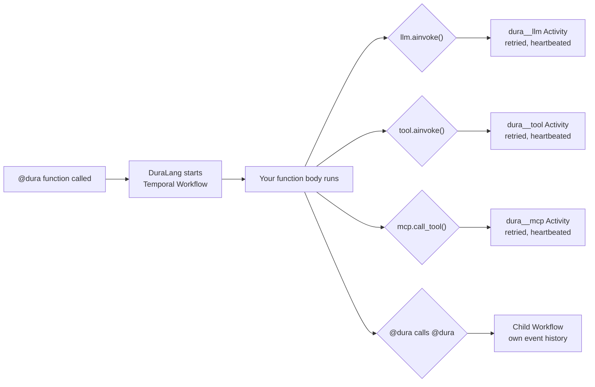
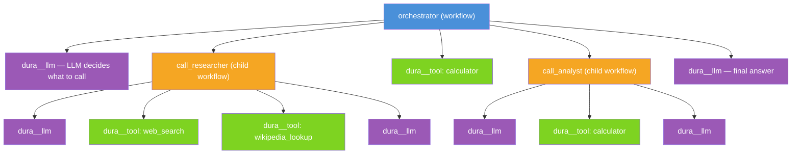

# DuraLang

**LangChain agents that cannot fail. One decorator.**

> The LLM is stochastic — it decides which tools to call, how many times to loop, when to stop. DuraLang doesn't change that. It just makes sure **whatever the LLM decides to do cannot fail permanently.** Nondeterminism in the model. Durability in [Temporal](https://temporal.io/).

---

## 🔍 Before & After

Your code stays identical. One decorator is the only difference.

```python
# ─── Before: standard LangChain ─────────────────────────────────────────────
# Every LLM call can timeout. Every tool call can fail. Every crash loses everything.

async def my_agent(messages):
    llm = ChatAnthropic(model="claude-sonnet-4-6")
    tools = [TavilySearchResults(), calculator]
    llm_with_tools = llm.bind_tools(tools)

    while True:
        response = await llm_with_tools.ainvoke(messages)       # can timeout
        messages.append(response)
        if not response.tool_calls:
            break
        for tc in response.tool_calls:
            result = await tools_by_name[tc["name"]].ainvoke(tc["args"])  # can fail
            messages.append(ToolMessage(content=str(result), tool_call_id=tc["id"]))
    return messages
```

```python
# ─── After: DuraLang ────────────────────────────────────────────────────────
# Every LLM call is retried. Every tool call is retried. Every crash is recovered.

from duralang import dura

@dura                                                           # <- only change
async def my_agent(messages):
    llm = ChatAnthropic(model="claude-sonnet-4-6")
    tools = [TavilySearchResults(), calculator]
    llm_with_tools = llm.bind_tools(tools)

    while True:
        response = await llm_with_tools.ainvoke(messages)       # -> Temporal Activity
        messages.append(response)
        if not response.tool_calls:
            break
        for tc in response.tool_calls:
            result = await tools_by_name[tc["name"]].ainvoke(tc["args"])  # -> Temporal Activity
            messages.append(ToolMessage(content=str(result), tool_call_id=tc["id"]))
    return messages

# Call it like a normal async function
result = await my_agent([HumanMessage(content="What is the weather in NYC?")])
```

**The function body is character-for-character identical.** DuraLang intercepts at the method level. The LLM still decides everything. Every decision it makes is now durable.

---

## 💥 The Problem

LLM agents are stochastic. The model decides the execution path at runtime — which tools to call, how many times to loop, whether to delegate. Every run is different. Every step can fail.

```
Research agent — 30+ calls, any can fail:

  LLM call 1 ✓  →  tool call ✓  →  LLM call 2 ✓  →  tool call ✓  →  LLM call 3 ✓
  →  tool call ✗ API DOWN  →  💥 crash  →  everything lost  →  start over  →  re-pay for 5 LLM calls
```

**You can't retry the agent. You can only restart it.** And restarting means re-paying for every LLM call that already succeeded.

Manual retry logic doesn't scale — a 30-step agent has 30 potential failure points. Writing try/catch and checkpointing for each one buries your agent logic under infrastructure code.

### Why graphs don't solve this

Frameworks like LangGraph give you a deterministic graph with stochastic nodes. You predefine the path. Checkpoints happen at node boundaries.

But **the LLM decides what happens next** — not your graph edges. Forcing stochastic behavior into a fixed graph means either over-specifying edges or cramming all logic into one opaque node.

```
┌─────────────────────────────────────────────────────────┐
│  LangGraph                                              │
│                                                         │
│  [Node A] ──edge──> [Node B] ──edge──> [Node C]        │
│                                                         │
│  You define the path. Checkpoints at node boundaries.   │
│  The stochastic part is trapped inside each node.       │
│  You can't see inside. You can't retry inside.          │
└─────────────────────────────────────────────────────────┘

┌─────────────────────────────────────────────────────────┐
│  DuraLang                                               │
│                                                         │
│  Your code IS the control flow.                         │
│  The LLM decides at runtime. No graph. No edges.        │
│  Every individual call is durable and observable.        │
│  If call 15 fails, calls 1–14 are not re-executed.      │
└─────────────────────────────────────────────────────────┘
```

**The core insight:** LLM calls are like microservice calls — unreliable, variable-latency, side-effectful. The infrastructure world solved this with durable execution. DuraLang brings that to LangChain.

---

## ✅ The Solution

DuraLang makes **every individual operation durable**. Each LLM call, tool call, and agent call is recorded in Temporal's immutable event history. If anything fails, execution resumes from the last successful step.

```
Without DuraLang:
  LLM 1 ✓ → Tool ✓ → LLM 2 ✓ → Tool ✗ CRASH
  Result: everything lost. Start over. Re-pay for all LLM calls.

With DuraLang:
  LLM 1 ✓ → Tool ✓ → LLM 2 ✓ → Tool ✗ CRASH
  ↓ worker restarts
  LLM 1 (replay) → Tool (replay) → LLM 2 (replay) → Tool ✓ RETRIED
  Result: resumed from crash point. Zero wasted LLM calls. Zero wasted money.
```

**Replayed steps are not re-executed.** They're read from Temporal's event history. No duplicate LLM calls. No duplicate API charges.

---

## 🚀 Quick Start

```bash
pip install "duralang[anthropic]"
temporal server start-dev
```

```python
import asyncio
from langchain_anthropic import ChatAnthropic
from langchain_community.tools.tavily_search import TavilySearchResults
from langchain_core.messages import HumanMessage, ToolMessage
from duralang import dura

tools = [TavilySearchResults(max_results=3)]
tools_by_name = {t.name: t for t in tools}

@dura
async def research_agent(messages: list) -> list:
    llm = ChatAnthropic(model="claude-sonnet-4-6")
    llm_with_tools = llm.bind_tools(tools)

    while True:
        response = await llm_with_tools.ainvoke(messages)
        messages.append(response)
        if not response.tool_calls:
            break
        for tc in response.tool_calls:
            result = await tools_by_name[tc["name"]].ainvoke(tc["args"])
            messages.append(ToolMessage(content=str(result), tool_call_id=tc["id"]))
    return messages

asyncio.run(research_agent([HumanMessage(content="Latest developments in AI agents?")]))
```

**This is standard LangChain.** The only addition is `@dura`. Every `ainvoke()` is now a Temporal Activity — retried, heartbeated, durable.

---

## 🛡️ What Happens When Things Fail

| Failure | Without DuraLang | With `@dura` |
|---|---|---|
| LLM call times out | Agent crashes, all state lost | Retried with backoff |
| Tool throws an error | Unhandled exception kills the run | Retried or error returned gracefully |
| Worker crashes mid-run | Start over, re-pay for all LLM calls | Replays from last step, zero waste |
| Rate limited on call 15/20 | You write retry logic by hand | Automatic backoff |
| Tool hangs forever | Agent hangs forever | Heartbeat detects it, retries |
| LLM returns malformed output | Crash, no recovery | LLM call retried |
| Something fails, you don't know what | Stack trace, no context | Full I/O and timing in Temporal UI |

---

## 🔬 Full Observability — For Free

The LLM decides the execution path at runtime. Every run is different. Without instrumentation, you're debugging a black box.

DuraLang gives you **complete visibility into every agent run, automatically.** Every LLM call, tool call, and agent call is a Temporal Activity:

| You get | What it shows |
|---|---|
| **Exact input/output** | What the LLM received, what it returned |
| **Timing** | How long each LLM call and tool call took |
| **Status** | Succeeded, failed, retrying, timed out — at a glance |
| **Retry history** | Attempt 1 failed at 2.1s, attempt 2 succeeded at 1.8s |
| **Event history** | Immutable, append-only, replay-safe |

```
orchestrator                                        Status    Duration
├── dura__llm                                       ✓         1.2s
├── call_researcher (child workflow)                ✓         8.4s
│   ├── dura__llm                                   ✓         2.1s
│   ├── dura__tool: web_search                      ✓         3.2s
│   ├── dura__tool: wikipedia_lookup                ✗ → ✓     0.8s  (retry 1: timeout → retry 2: ok)
│   └── dura__llm                                   ✓         1.9s
├── dura__tool: calculator                          ✓         0.1s
├── call_analyst (child workflow)                   ✓         5.2s
│   ├── dura__llm                                   ✓         1.8s
│   ├── dura__tool: calculator                      ✓         0.1s
│   └── dura__llm                                   ✓         2.4s
└── dura__llm                                       ✓         1.1s
```

**No logging code. No tracing middleware. No dashboards to configure.** This is what you get in the Temporal UI for every run, for free.

For stochastic workflows where the path is different every time, this level of observability does not exist out of the box anywhere else.

---

## ⚙️ How It Works



DuraLang intercepts calls at the method level using proxy objects. **Your code doesn't know Temporal exists.**

| What you write | What runs under the hood |
|---|---|
| `llm.ainvoke(messages)` | Temporal Activity: `dura__llm` |
| `tool.ainvoke(input)` | Temporal Activity: `dura__tool` |
| `mcp_session.call_tool(...)` | Temporal Activity: `dura__mcp` |
| `@dura` calling `@dura` | Temporal Child Workflow |
| `dura_agent_tool(fn).ainvoke(args)` | Child Workflow (via `BaseTool`) |

Outside `@dura`, your code runs as normal LangChain — zero interception.
Inside `@dura`, every call is retried, observable, timeoutable, and durable.

---

## 🤖 Multi-Agent Orchestration

`dura_agent_tool()` wraps a `@dura` function as a real LangChain `BaseTool`. Sub-agents and regular tools go in the **same list, same `bind_tools()`, same `ainvoke()` loop.**

The LLM decides which agents to call and in what order. DuraLang makes each one durable.

```python
from duralang import dura, dura_agent_tool

@dura
async def researcher(query: str) -> str:
    """Research agent — gathers information via web search."""
    llm = ChatAnthropic(model="claude-sonnet-4-6")
    llm_with_tools = llm.bind_tools([web_search, wikipedia_lookup])
    # ... standard agent loop ...
    return response.content

@dura
async def analyst(data: str, question: str) -> str:
    """Analysis agent — runs calculations and identifies trends."""
    llm = ChatAnthropic(model="claude-sonnet-4-6")
    llm_with_tools = llm.bind_tools([calculator])
    # ... standard agent loop ...
    return response.content

# Sub-agents and regular tools — same list
all_tools = [
    dura_agent_tool(researcher),   # → Child Workflow
    dura_agent_tool(analyst),      # → Child Workflow
    calculator,                     # → Activity
]
tools_by_name = {t.name: t for t in all_tools}

@dura
async def orchestrator(task: str) -> str:
    llm = ChatAnthropic(model="claude-sonnet-4-6")
    llm_with_tools = llm.bind_tools(all_tools)

    messages = [HumanMessage(content=task)]
    while True:
        response = await llm_with_tools.ainvoke(messages)
        messages.append(response)
        if not response.tool_calls:
            break
        for tc in response.tool_calls:
            result = await tools_by_name[tc["name"]].ainvoke(tc["args"])
            messages.append(ToolMessage(content=str(result), tool_call_id=tc["id"]))
    return response.content
```

**The execution path is fully stochastic** — different every run. But every operation is individually durable:



If `call_researcher` fails, **only that child retries.** Everything else is untouched. This nests to any depth — agents calling agents calling agents, each with independent durability.

---

## 📋 Features

| Category | What you get |
|---|---|
| **Durability** | Every LLM call, tool call, and agent call is individually durable. Crash recovery replays from last completed step. |
| **Observability** | Full input/output, timing, status, and retry history for every call — free via Temporal UI. |
| **Retries** | Transient failures retried with configurable backoff. Non-retryable errors returned gracefully. |
| **Heartbeating** | Long-running calls monitored. Hung operations detected and retried automatically. |
| **Multi-agent** | `@dura` calling `@dura` = Child Workflows. `dura_agent_tool()` mixes sub-agents with regular tools. Nests to any depth. |
| **Parallel tools** | `asyncio.gather` works as expected. Each tool call is its own Activity. |
| **Model-agnostic** | Anthropic, OpenAI, Google, Ollama — any `BaseChatModel`. |
| **MCP support** | MCP servers via `DuraMCPSession`. |
| **Zero new abstractions** | No graphs, no nodes, no edges, no state channels. Your LangChain code + `@dura`. |

---

## 📖 Documentation

| | |
|---|---|
| [Getting Started](docs/getting-started.md) | [Core Concepts](docs/core-concepts.md) |
| [Configuration](docs/configuration.md) | [Activities](docs/activities.md) |
| [Tools & MCP](docs/tools-and-mcp.md) | [Architecture](docs/architecture.md) |
| [Error Handling](docs/error-handling.md) | [API Reference](docs/api-reference.md) |
| [Examples](docs/examples.md) | [FAQ](docs/faq.md) |

---

## Requirements

- Python 3.11+
- [Temporal Server](https://docs.temporal.io/cli#install) (local dev or Temporal Cloud)
- LLM API key (Anthropic, OpenAI, Google, or Ollama)

## License

MIT
