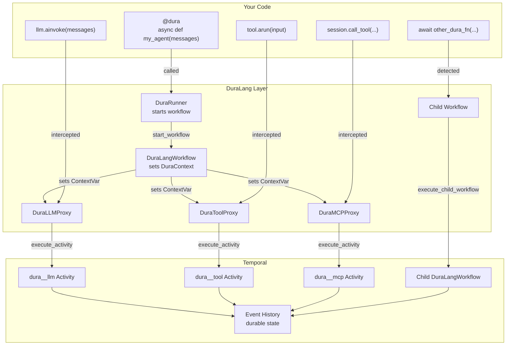
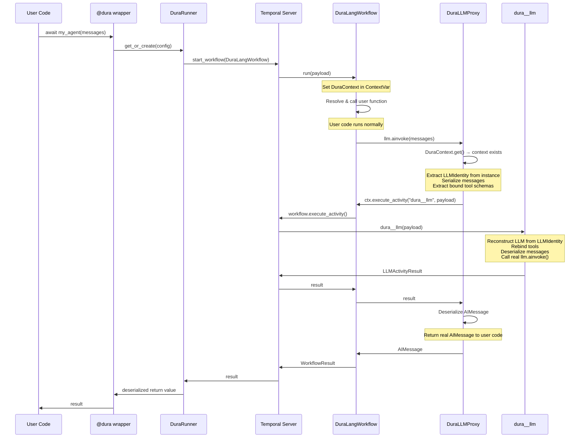
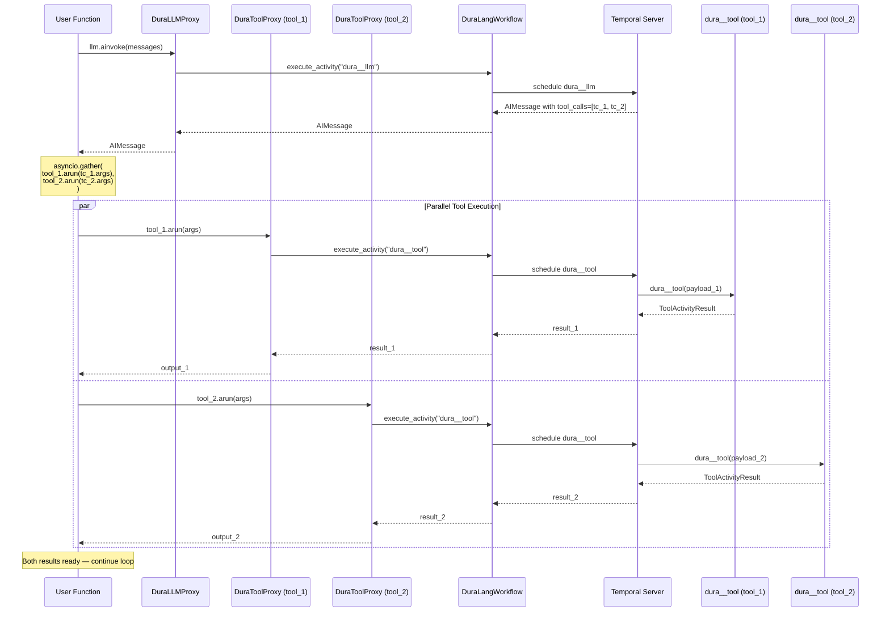
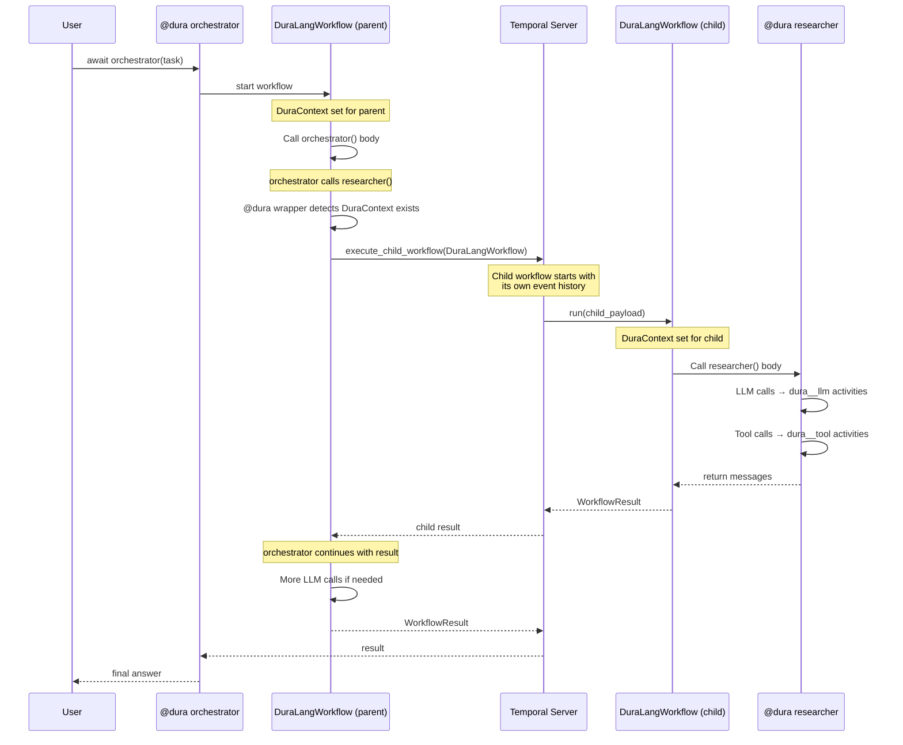
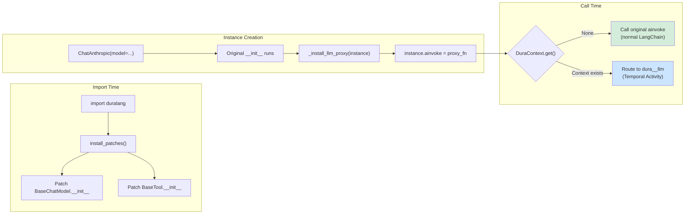
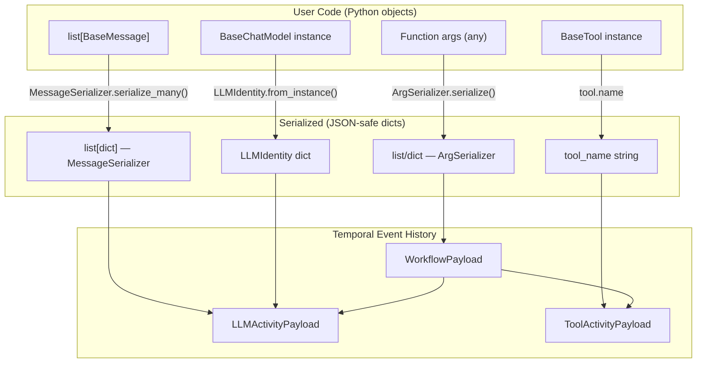
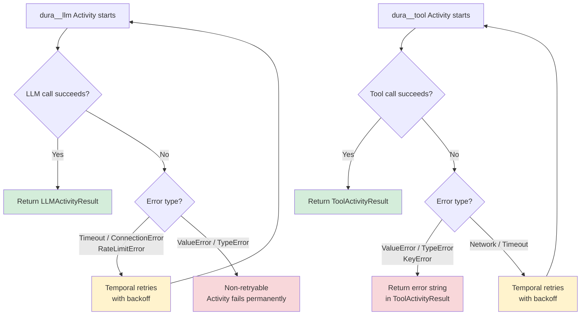
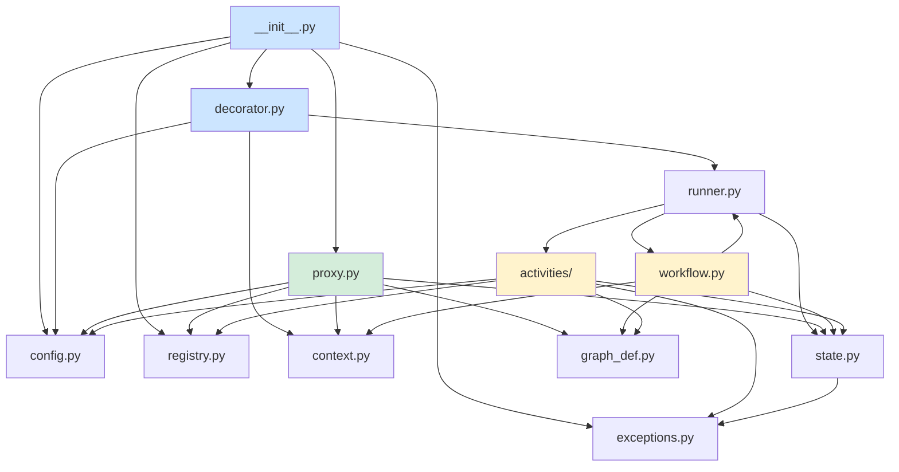

# Architecture

How DuraLang makes LangChain agents durable — from decorator to Temporal Activity.

---

## High-Level Overview

---

## Request Flow — Single LLM Call

What happens when a `@dura` function calls `llm.ainvoke(messages)`:

---

## Tool Call Flow — With Parallel Execution

When the LLM returns multiple tool calls and the user runs them with `asyncio.gather`:

---

## Multi-Agent Flow — Child Workflows

When a `@dura` function calls another `@dura` function:

---

## Proxy Interception — How It Works

---

## Serialization Boundaries

Data must cross serialization boundaries at the Temporal API:

---

## Failure & Retry

---

## Module Dependency Graph

---

## Component Summary

| Component | Role |
|---|---|
| `@dura` | Entry point — wraps user function, starts workflow |
| `DuraContext` | ContextVar bridge — proxies read it to decide routing |
| `DuraLLMProxy` | Intercepts `ainvoke()` — routes to `dura__llm` |
| `DuraToolProxy` | Intercepts `ainvoke()` — routes to `dura__tool` |
| `DuraMCPProxy` | Intercepts `call_tool()` — routes to `dura__mcp` |
| `DuraRunner` | Temporal client/worker lifecycle — singleton per config |
| `DuraLangWorkflow` | Temporal workflow — sets context, runs user function |
| `dura__llm` | Activity — reconstructs LLM, calls `ainvoke()` |
| `dura__tool` | Activity — looks up tool, calls `ainvoke()` |
| `dura__mcp` | Activity — looks up session, calls `call_tool()` |
| `LLMIdentity` | Serializable LLM descriptor — crosses Temporal boundary |
| `ArgSerializer` | Serializes function args for workflow payload |
| `MessageSerializer` | Serializes LangChain messages for activity payloads |
