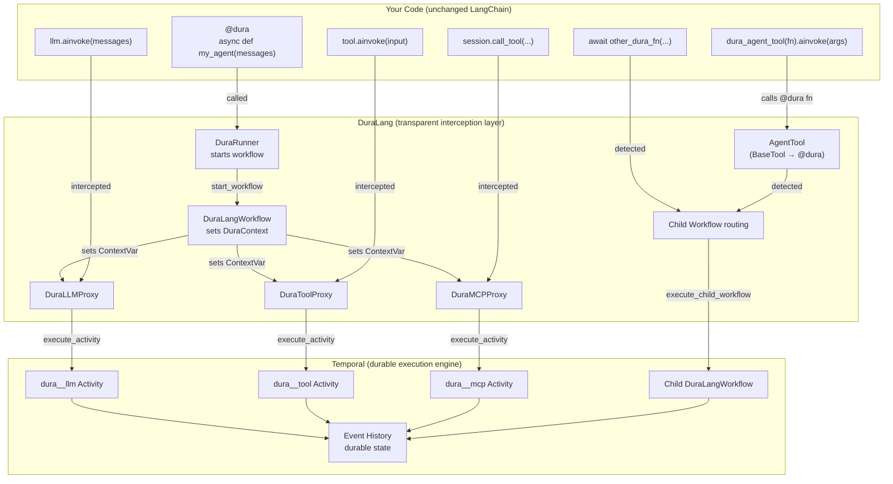
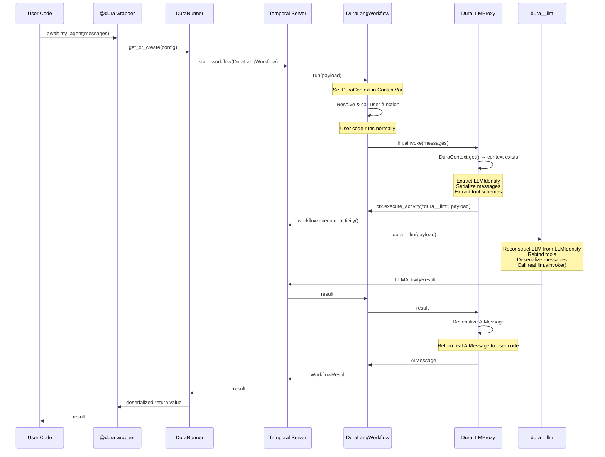
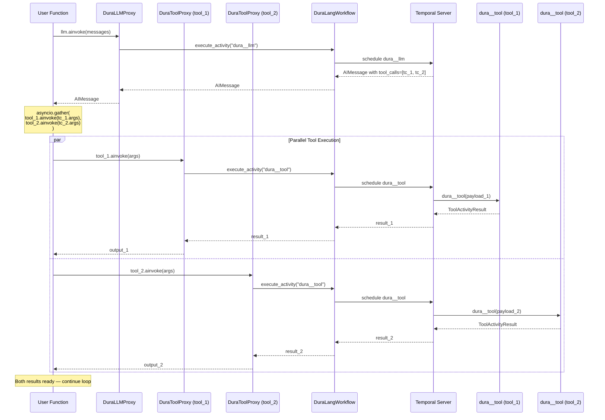
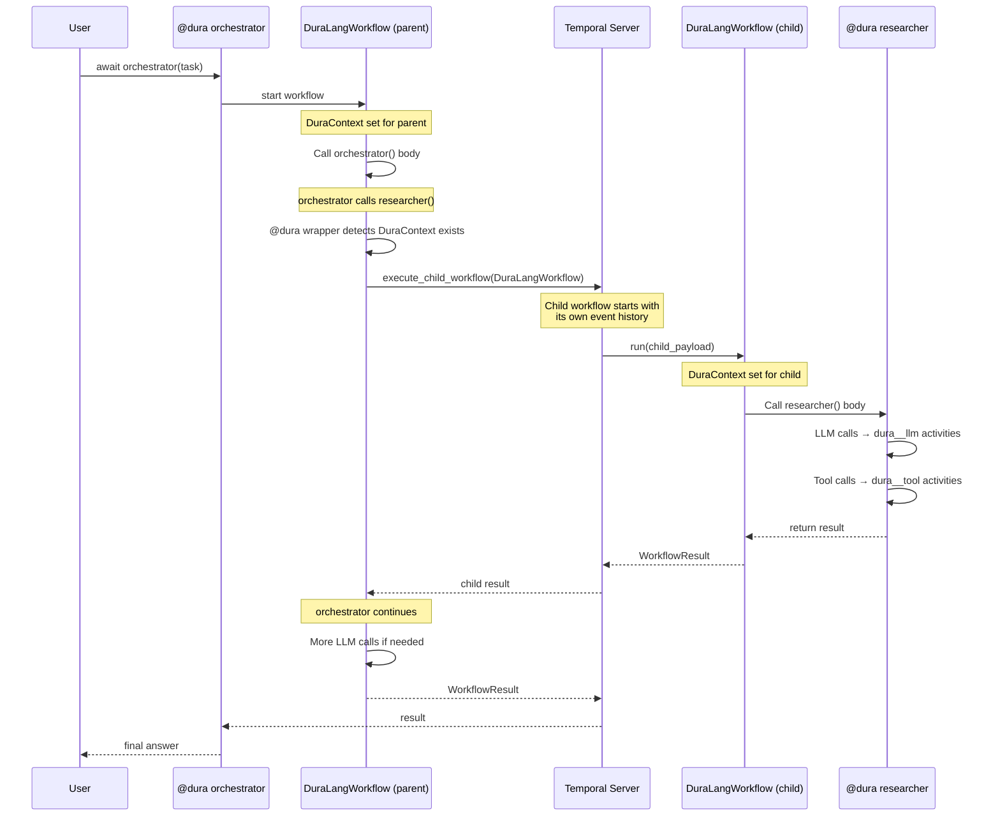
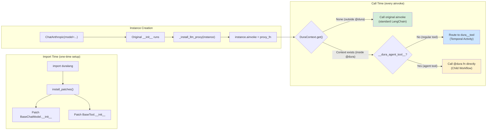
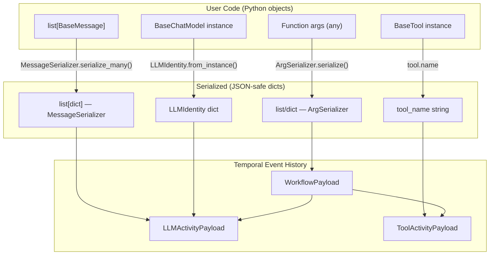
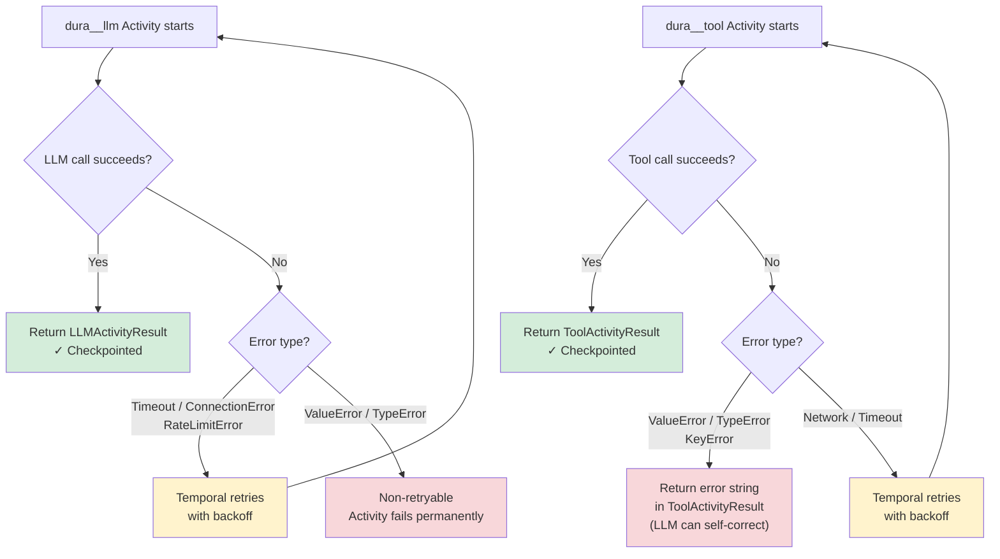
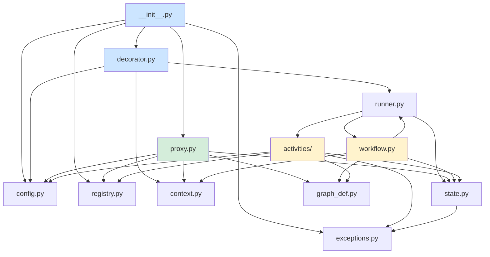

# Architecture

A complete technical walkthrough of how DuraLang makes LangChain agents durable — from the `@dura` decorator down to Temporal Activities.

---

## High-Level Overview

DuraLang sits between your LangChain code and Temporal. It intercepts LLM calls, tool calls, and MCP calls at the method level and routes each one through a Temporal Activity or Child Workflow.



**Key insight:** Your code (top layer) is unchanged LangChain. The DuraLang layer (middle) is completely transparent. Temporal (bottom) provides the durable execution guarantees.

---

## Request Flow — Single LLM Call

What happens, step by step, when a `@dura` function calls `llm.ainvoke(messages)`:



**The user code sees:** `response = await llm.ainvoke(messages)` returning an `AIMessage` — exactly as if DuraLang wasn't there. But behind the scenes, the call was routed through Temporal with full retry, heartbeat, and checkpoint guarantees.

---

## Tool Call Flow — Parallel Execution

When the LLM returns multiple tool calls and the user runs them with `asyncio.gather`:



**Key point:** If `tool_1` fails and retries, `tool_2`'s result is already checkpointed. Only the failed operation retries.

---

## Multi-Agent Flow — Child Workflows

When a `@dura` function calls another `@dura` function (either directly or via `dura_agent_tool()`):



**Key point:** The child workflow has its own event history. If the child fails, only the child retries. The parent's completed work is preserved.

---

## Proxy Interception — Decision Flow

How the proxy decides whether to intercept or pass through:



**Three outcomes:**
- 🟢 **Green:** Outside `@dura` — vanilla LangChain behavior (zero overhead)
- 🔵 **Blue:** Regular tool inside `@dura` — routed to Temporal Activity
- 🟡 **Yellow:** Agent tool inside `@dura` — routed to Child Workflow

---

## Serialization Boundaries

Data must be JSON-serializable to cross Temporal's boundary. This diagram shows what gets serialized and how:



**Key design decision:** LLM objects and tool objects are never serialized directly. Instead, lightweight identifiers cross the boundary — `LLMIdentity` for models, tool name strings for tools. The real objects are reconstructed or looked up on the Activity side.

---

## Failure & Retry Flow

How errors are classified and handled:



**Note the difference:** Tool logic errors (`ValueError`, `TypeError`, `KeyError`) are returned as error strings — the LLM receives them as feedback and can self-correct. LLM logic errors fail permanently (they're typically configuration issues).

---

## Module Dependency Graph

How the modules depend on each other:



**Color coding:**
- 🔵 **Blue:** Entry points — what the user imports
- 🟢 **Green:** Interception layer — proxy routing
- 🟡 **Yellow:** Temporal integration — workflows and activities

---

## Component Summary

| Component | File | Role |
|---|---|---|
| `@dura` | `decorator.py` | Entry point — wraps user function, starts workflow or child workflow |
| `dura_agent_tool()` | `agent_tool.py` | Wraps `@dura` function as `BaseTool` — agents and tools in same list |
| `DuraContext` | `context.py` | `ContextVar` bridge — proxies read it to decide routing |
| `DuraLLMProxy` | `proxy.py` | Intercepts `ainvoke()` on `BaseChatModel` → routes to `dura__llm` |
| `DuraToolProxy` | `proxy.py` | Intercepts `ainvoke()` on `BaseTool` → routes to `dura__tool` (skips agent tools) |
| `DuraMCPProxy` | `proxy.py` | Intercepts `call_tool()` on MCP sessions → routes to `dura__mcp` |
| `DuraRunner` | `runner.py` | Temporal client/worker lifecycle — singleton per `(host, task_queue)` |
| `DuraLangWorkflow` | `workflow.py` | Temporal workflow — sets context, resolves function, executes user code |
| `dura__llm` | `activities/llm.py` | Activity — reconstructs LLM from identity, calls `ainvoke()` |
| `dura__tool` | `activities/tool.py` | Activity — looks up tool in registry, calls `ainvoke()` |
| `dura__mcp` | `activities/mcp.py` | Activity — looks up MCP session, calls `call_tool()` |
| `LLMIdentity` | `config.py` | Serializable LLM descriptor — crosses Temporal boundary |
| `ArgSerializer` | `state.py` | Serializes function args for workflow payload |
| `MessageSerializer` | `state.py` | Serializes LangChain messages for activity payloads |
| `ToolRegistry` | `registry.py` | Auto-populated tool registry — maps names to `BaseTool` instances |
| `MCPSessionRegistry` | `registry.py` | MCP session registry — maps server names to `ClientSession` instances |
| `DuraConfig` | `config.py` | Top-level Temporal configuration |
| `ActivityConfig` | `config.py` | Per-activity timeout, heartbeat, and retry configuration |

---

## File Structure

```
duralang/
├── __init__.py              # Exports: dura, dura_agent_tool, DuraConfig, DuraMCPSession
├── decorator.py             # @dura — the entire public API
├── proxy.py                 # DuraLLMProxy, DuraToolProxy, DuraMCPProxy, install_patches()
├── agent_tool.py            # dura_agent_tool() — wraps @dura as BaseTool
├── context.py               # DuraContext — ContextVar-based workflow context
├── workflow.py              # DuraLangWorkflow — Temporal workflow definition
├── runner.py                # DuraRunner — Temporal client + worker lifecycle
├── activities/
│   ├── __init__.py          # Exports: llm_activity, tool_activity, mcp_activity
│   ├── llm.py               # dura__llm — LLM inference activity
│   ├── tool.py              # dura__tool — tool execution activity
│   └── mcp.py               # dura__mcp — MCP call activity
├── graph_def.py             # Payload/Result dataclasses for Temporal
├── state.py                 # MessageSerializer + ArgSerializer
├── config.py                # DuraConfig, ActivityConfig, LLMIdentity
├── registry.py              # ToolRegistry, MCPSessionRegistry
├── exceptions.py            # Exception hierarchy
├── cli.py                   # duralang CLI (worker management)
└── py.typed                 # PEP 561 marker for type checking
```
