# Temporal Internals — How DuraLang Uses Temporal Under the Hood

This document explains the infrastructure layer of DuraLang: how Temporal orchestrates
your agent's execution, where the overhead comes from, what the limits are, and how
crash recovery, retries, timeouts, and multi-agent delegation actually work.

> **Audience:** DuraLang users who want to understand *why* things work the way they do,
> and operators who need to plan infrastructure, capacity, and failure modes.

---

## Table of Contents

1. [Network Topology — Where Calls Actually Go](#1-network-topology)
2. [The Full Request Lifecycle](#2-the-full-request-lifecycle)
3. [Timeouts and Retries](#3-timeouts-and-retries)
4. [Heartbeats — Keeping Long Calls Alive](#4-heartbeats)
5. [Multi-Agent Routing — Activities vs Child Workflows](#5-multi-agent-routing)
6. [Payload Limits and Serialization](#6-payload-limits-and-serialization)
7. [Crash Recovery — The Whole Point](#7-crash-recovery)
8. [Event History Limits](#8-event-history-limits)
9. [Performance Overhead](#9-performance-overhead)
10. [Determinism Requirements](#10-determinism-requirements)
11. [Operational Considerations](#11-operational-considerations)
12. [When Temporal is (and isn't) Worth It](#12-when-temporal-is-worth-it)

---

## 1. Network Topology

### Where calls actually go

A common misconception is that Temporal proxies your LLM/tool calls. **It does not.**
Temporal is a coordination database — it tells your worker *what to run* and records
*that it ran*. The actual execution (LLM inference, tool calls, MCP) happens directly
from your application node.

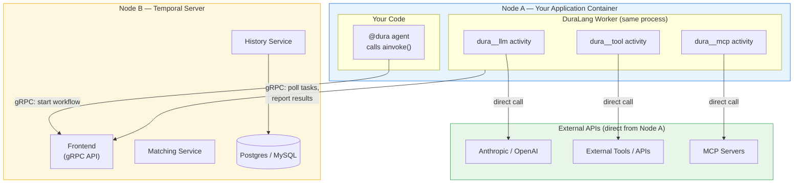

**Key takeaway:** LLM and tool traffic flows **directly** from Node A to external APIs.
Temporal (Node B) only handles coordination metadata via gRPC. Your API keys, request
payloads, and model responses traverse A → External API, never through Temporal's server.

### What goes over the wire to Temporal

Only serialized metadata and state — never raw LLM traffic:

| Data | Direction | Typical Size |
|---|---|---|
| "Start workflow with args" | A → B | Serialized function arguments |
| "Here's your next task" | B → A | Activity payload (messages + LLM identity) |
| "Task completed with result" | A → B | Serialized LLM response or tool output |
| "Workflow finished" | A → B | Final return value |

### Recommended deployment

| Environment | Setup |
|---|---|
| **Development** | Same machine — Temporal CLI runs in-memory server |
| **Production** | Separate nodes — Temporal Server with persistent DB (Postgres/MySQL), replicated |
| **Scaling** | Multiple worker nodes (A₁, A₂, A₃) polling same Temporal task queue |

---

## 2. The Full Request Lifecycle

Here is the complete sequence for a `@dura` agent that makes one LLM call and one tool
call, including the return path:

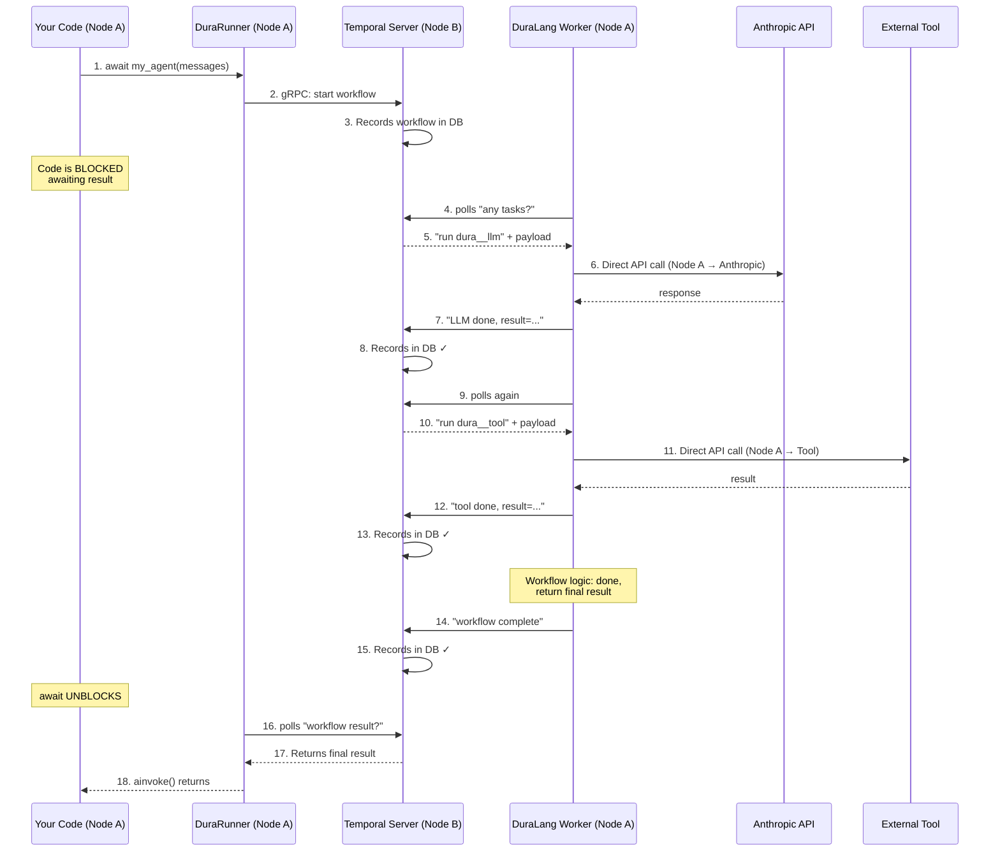

**Important:** Steps 2 (caller) and 4-14 (worker) are in the **same Python process**.
The caller is simply `await`ing. The Temporal server acts as a shared bulletin board —
the worker posts results, the caller reads them. Data does not travel A → B → A for
execution; it's recorded on B for durability, then read back by A.

---

## 3. Timeouts and Retries

### DuraLang's default timeout configuration

From `duralang/config.py`:

| Activity | `start_to_close_timeout` | `heartbeat_timeout` | Max retries | Non-retryable errors |
|---|---|---|---|---|
| `dura__llm` | 10 minutes | 5 minutes | 3 | `ValueError`, `TypeError` |
| `dura__tool` | 2 minutes | 30 seconds | 3 | `ValueError`, `TypeError`, `KeyError` |
| `dura__mcp` | 5 minutes | 30 seconds | 3 | (default) |

### How retries work — example with a failing tool call

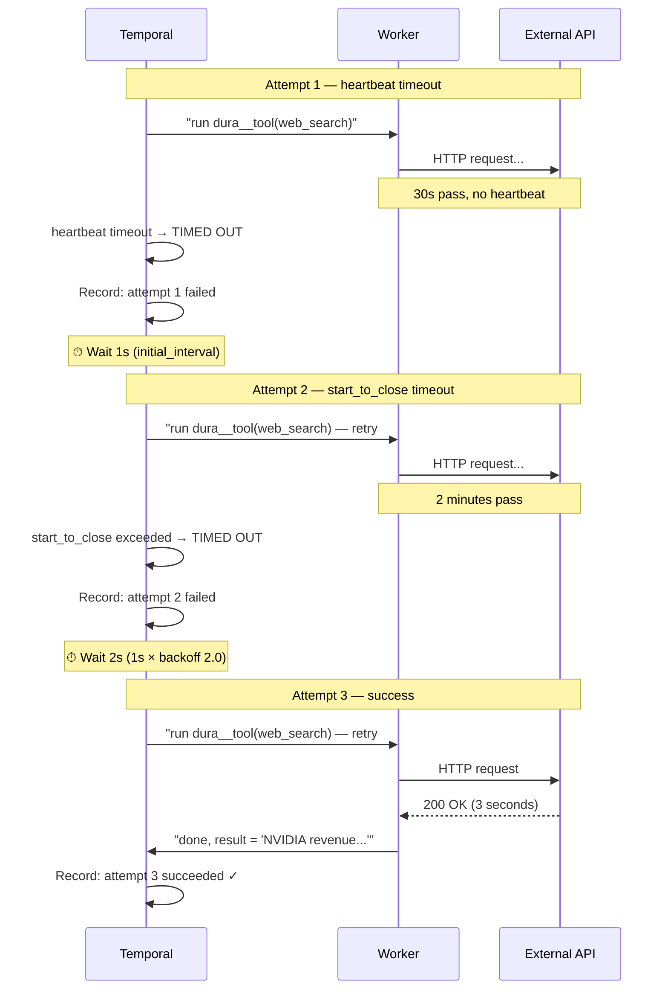

### Non-retryable errors — fail fast

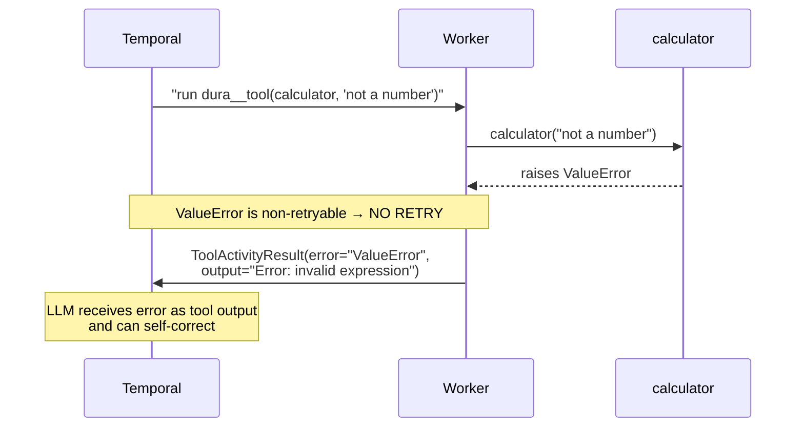

### Backoff progression

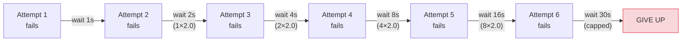

### Customizing timeouts

```python
from datetime import timedelta
from duralang import dura, DuraConfig
from duralang.config import ActivityConfig

@dura(config=DuraConfig(
    tool_config=ActivityConfig(
        start_to_close_timeout=timedelta(hours=1),    # long-running tool
        heartbeat_timeout=timedelta(minutes=5),
    ),
    llm_config=ActivityConfig(
        start_to_close_timeout=timedelta(minutes=30),  # slow model
    ),
))
async def my_agent(task: str):
    ...
```

Temporal itself has **no hard cap** on activity duration. As long as the activity
heartbeats within `heartbeat_timeout`, it can run indefinitely.

---

## 4. Heartbeats

### The problem

An LLM inference call can take 30-120 seconds (especially for large prompts or
models like Claude Opus). If the `heartbeat_timeout` is 30 seconds and the activity
doesn't send a heartbeat, Temporal assumes it's stuck and kills it.

### The solution — concurrent heartbeat loop

DuraLang runs the LLM call and a heartbeat loop concurrently using `asyncio`:

```python
async def with_heartbeats(coro, interval=15.0):
    task = asyncio.create_task(coro)        # LLM call runs in background
    elapsed = 0
    while not task.done():
        try:
            return await asyncio.wait_for(
                asyncio.shield(task),        # don't cancel the actual LLM call
                timeout=interval             # check every 15s
            )
        except asyncio.TimeoutError:
            elapsed += interval
            activity.heartbeat(f"still running ({elapsed}s)")  # ping Temporal
    return task.result()
```

### What happens at runtime

```mermaid
gantt
    title Heartbeat Timeline — 52s LLM Call
    dateFormat ss
    axisFormat %Ss

    section LLM Call
    Calling Anthropic API          :active, llm, 00, 52s

    section Heartbeat Loop
    heartbeat("15s")               :milestone, hb1, 15, 0s
    heartbeat("30s")               :milestone, hb2, 30, 0s
    heartbeat("45s")               :milestone, hb3, 45, 0s

    section Temporal View
    Activity started               :milestone, start, 00, 0s
    alive ✓                        :milestone, a1, 15, 0s
    alive ✓                        :milestone, a2, 30, 0s
    alive ✓                        :milestone, a3, 45, 0s
    Activity completed ✓           :milestone, done, 52, 0s
```

**Without heartbeats:** Temporal sees nothing for 52s → kills it after 30s heartbeat timeout.
**With heartbeats:** Temporal gets pinged every 15s → lets it run the full `start_to_close_timeout`.

This works because `asyncio` is cooperative — the LLM HTTP request is I/O-bound,
so the heartbeat loop gets CPU time between I/O waits.

---

## 5. Multi-Agent Routing

### The critical design decision: activities vs child workflows

When an orchestrator agent calls a sub-agent, there are two possible mechanisms:

| Mechanism | Timeout applies | Event history | Recovery scope |
|---|---|---|---|
| **Activity** (`dura__tool`) | `tool_config` (2 min default) | Shared with parent | Parent retries everything |
| **Child Workflow** | `child_workflow_timeout` (1 hr default) | **Independent** | Only child retries |

**If a sub-agent ran as an activity:**

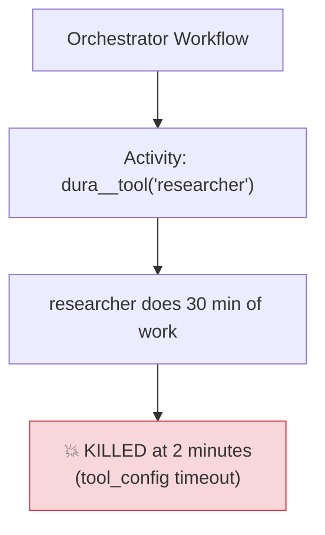

**DuraLang's solution — sub-agents are child workflows:**

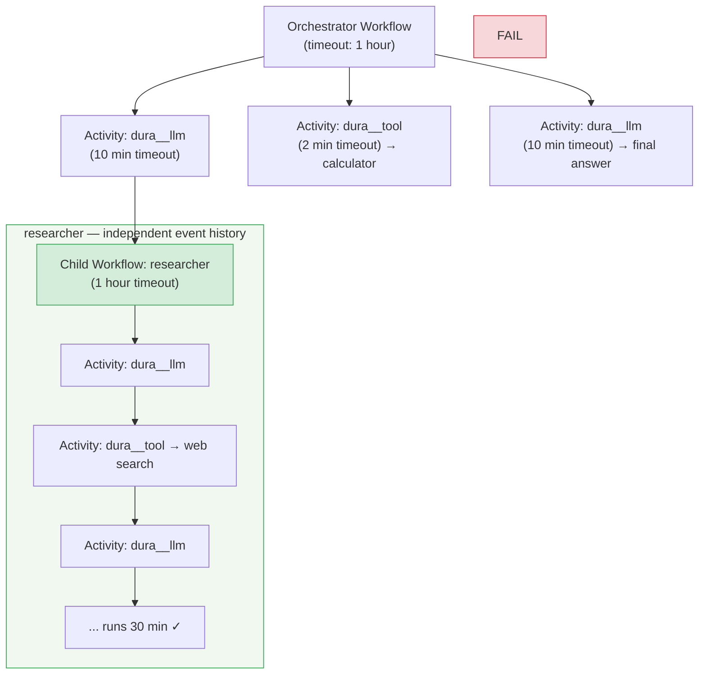

### How the routing works

`dura_agent()` auto-wraps `@dura` functions as agent tools.
When `DuraTool` intercepts the call, it checks for the `__dura_agent_tool__` flag:

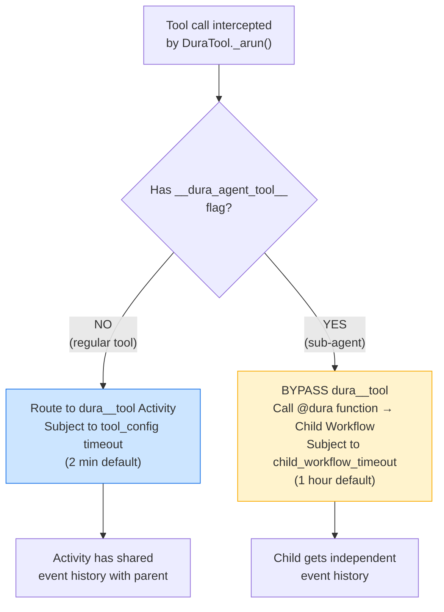

### Code example

```python
from duralang import dura, dura_agent

@dura
async def researcher(query: str) -> str:
    """Research sub-agent — may take 30+ minutes."""
    agent = dura_agent(model="claude-sonnet-4-6", tools=[TavilySearchResults()])
    result = await agent.ainvoke({"messages": [HumanMessage(content=query)]})
    return result["messages"][-1].content

@dura
async def orchestrator(task: str) -> str:
    agent = dura_agent(
        model="claude-sonnet-4-6",
        tools=[
            researcher,   # @dura → Child Workflow (1 hr timeout, auto-wrapped)
            calculator,   # @tool → dura__tool Activity (2 min timeout, auto-wrapped)
        ],
    )
    result = await agent.ainvoke({"messages": [HumanMessage(content=task)]})
    return result["messages"][-1].content
```

### Crash isolation

Each child workflow has its own Temporal event history. If the researcher
crashes at minute 25 of a 30-minute run:

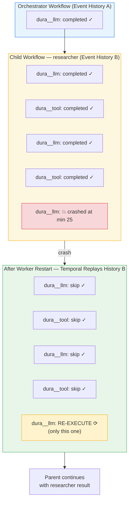

**Only the single failed LLM call is re-executed.** All prior work in both
the parent and child is preserved.

---

## 6. Payload Limits and Serialization

### Temporal's 2MB payload limit

Temporal enforces ~2MB max per gRPC message. Every piece of data crossing a
Temporal boundary must fit: activity inputs, activity results, workflow arguments,
workflow results.

### Will you hit this limit?

**For text-only agents: almost certainly not.** The LLM's context window is the
tighter constraint:

- 200K tokens ≈ ~800KB of text
- JSON serialization overhead adds ~30-50% → ~1.2MB max
- That's still well under 2MB

The agent (or LangChain internally) must already truncate/summarize history to
fit the model's context window — and that naturally keeps Temporal payloads small.

**For multi-modal agents: yes, this matters.**

| Content | LLM tokens | Serialized bytes |
|---|---|---|
| 100K words of text | ~130K tokens | ~600KB |
| One 1080p image | ~1,600 tokens | ~1.5MB (base64) |
| 5 screenshots | ~8,000 tokens | ~7.5MB ❌ |

An image uses very few LLM tokens (the provider resizes it internally) but the
base64-encoded payload in the message is 500KB-2MB of raw bytes. The LLM is happy;
Temporal is not.

### DuraLang's mitigation

DuraLang validates payload size *before* sending to Temporal, giving a clear error
message instead of a cryptic gRPC failure:

```
StateSerializationError: Serialized payload is 2,340,000 bytes,
exceeding Temporal ~2MB limit. Reduce message history or tool input size.
```

### Future mitigation strategies (not yet implemented)

- **External blob storage:** Store large payloads in S3/GCS, pass URI through Temporal
- **Temporal Codec Server:** Compress payloads before they hit the wire
- **Message windowing:** Only send last N messages, not full history

---

## 7. Crash Recovery

This is Temporal's core value proposition. Here's how it works concretely:

### Scenario: Process crashes mid-agent

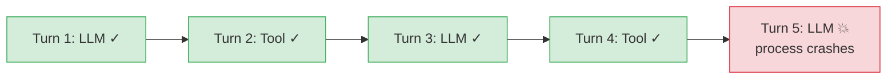

**Without DuraLang:** All work lost. Start from turn 1. Re-do 4 LLM/tool calls
(costs money, wastes time, may produce different results).

**With DuraLang:** Worker restarts, Temporal replays the workflow:

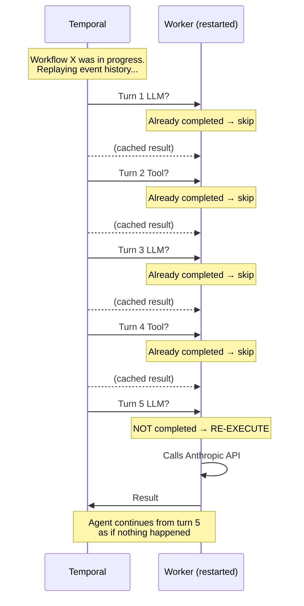

### What "replay" means

Temporal does not re-run your code. It re-feeds the recorded results of completed
activities back to the workflow logic, so the workflow reaches the same state it was
in before the crash. Then it continues forward from the point of failure.

This is why workflow code must be **deterministic** — see section 10.

---

## 8. Event History Limits

### The 50K event limit

Each Temporal workflow has a max event history of **50,000 events** (hard server limit).
Each activity consumes ~3 events:

| Event | Count |
|---|---|
| ActivityTaskScheduled | 1 |
| ActivityTaskStarted | 1 |
| ActivityTaskCompleted | 1 |
| **Total per activity** | **3** |

### How fast you consume events

| Agent pattern | Events per turn | Turns before limit |
|---|---|---|
| 1 LLM + 1 tool | ~6 events | ~8,000 turns |
| 1 LLM + 3 tools | ~12 events | ~4,000 turns |
| Multi-agent (2 child workflows/turn) | ~20+ events | ~2,500 turns |

For most agents, 50K events is plenty. Deep recursive multi-agent systems
with thousands of tool calls could hit this limit.

### Mitigation: continue-as-new

Temporal provides `continue_as_new()` — restart the workflow with fresh history
while preserving state. DuraLang can use this to periodically "compact" the history
for very long-running workflows.

---

## 9. Performance Overhead

### Per-operation latency

| Operation | Temporal overhead | Typical operation time | % overhead |
|---|---|---|---|
| LLM call | ~30-150ms | ~2,000-10,000ms | ~1-5% |
| Tool call | ~30-150ms | ~50-5,000ms | ~1-60% |
| Child workflow start | ~50-200ms | varies | one-time cost |
| Worker cold start | ~400-900ms | — | one-time cost |

The overhead is the gRPC round-trip: serialize → send to Temporal → poll →
deserialize. For LLM calls (seconds), it's negligible. For fast tools (milliseconds),
it's more noticeable.

### Per-turn cost example

A typical agent turn: 1 LLM call + 2 tool calls

```
Without DuraLang:  2,000ms (LLM) + 100ms (tools) = 2,100ms
With DuraLang:     2,150ms (LLM) + 400ms (tools) = 2,550ms
                                                     ────────
Overhead:                                            ~450ms (~21%)
```

Over a 30-turn conversation: ~13.5 seconds of cumulative Temporal overhead.

### Cold start

The first `@dura` call in a process incurs:
- Temporal client connection: ~100-300ms
- Worker startup: ~200-400ms
- LangChain import chain: ~100-200ms

Total: ~400-900ms one-time cost. Subsequent calls reuse the singleton runner.

---

## 10. Determinism Requirements

### Why determinism matters

Temporal replays workflow code to reconstruct state after crashes. If the workflow
makes different decisions on replay than it did originally, the state is corrupted
and the workflow gets stuck.

### What you MUST NOT do in `@dura` function bodies

```python
@dura
async def my_agent(task: str):
    # ❌ NON-DETERMINISTIC — different result on replay
    if random.random() > 0.5:
        ...
    if datetime.now().hour > 12:
        ...
    data = await httpx.get("https://api.example.com/data")  # network call

    # ✅ SAFE — deterministic, or routed through Temporal
    result = await llm.ainvoke(messages)     # → Temporal Activity (replayed)
    output = await tool.ainvoke(input)       # → Temporal Activity (replayed)
    sub = await researcher(query)            # → Child Workflow (replayed)
```

### DuraLang's stance

DuraLang runs with `sandboxed=False` in the Temporal workflow definition. This
means Temporal's determinism detector is **disabled** — non-deterministic code
won't be caught automatically. This is necessary because LangChain's import chain
triggers false positives in the sandbox detector.

**The safety contract:** As long as your `@dura` function only calls LLM, tool,
and MCP operations (all routed through Temporal), determinism is maintained.
The risky code (random, time, network) should live in tools, not in the workflow body.

---

## 11. Operational Considerations

### Infrastructure requirements

| Component | Dev | Production |
|---|---|---|
| Temporal Server | CLI (in-memory) | Dedicated service with persistent DB |
| Database | None (in-memory) | Postgres or MySQL (with backups) |
| Workers | Same process | Multiple replicas, auto-scaling |
| Monitoring | Temporal Web UI | Prometheus + Grafana + alerting |
| TLS | Not needed | Required for cross-node gRPC |

### Temporal Cloud vs self-hosted

| Factor | Self-hosted | Temporal Cloud |
|---|---|---|
| Ops burden | You manage server + DB | Managed |
| Cost | Infrastructure cost | Per-action pricing |
| Latency | Local network | Cloud region dependent |
| Compliance | Full control | Check data residency |

### Key metrics to monitor

- **Workflow task queue depth** — if growing, workers can't keep up
- **Activity task queue depth** — if growing, too many concurrent activities
- **Schedule-to-start latency** — time between "task scheduled" and "worker picks it up"
- **Workflow failure rate** — should be near zero in normal operation
- **Event history size** — watch for workflows approaching 50K events

---

## 12. When Temporal is Worth It

### ✅ Use DuraLang when:

| Scenario | Why |
|---|---|
| Multi-hour agent workflows | Survives process crashes, node evictions, deploys |
| Multi-agent orchestration | Each agent independently durable with crash isolation |
| Mission-critical pipelines | Exactly-once execution guarantees |
| Production systems with SLAs | Observable, recoverable, auditable |
| Agents spending real money | No duplicate API calls, purchases, or side effects |
| Long tool calls (DB migrations, CI/CD) | Timeouts, retries, and heartbeats built in |

### ❌ Don't use DuraLang when:

| Scenario | Why |
|---|---|
| Quick chatbot (< 5 turns) | Overhead exceeds benefit |
| Stateless tool calls | Nothing to protect |
| Single-shot LLM calls | Just retry manually |
| Prototyping / dev phase | Adds infrastructure complexity |
| Latency-critical real-time apps | 30-150ms per-call overhead matters |

### The honest trade-off

Temporal adds **~1.5-2.5x latency overhead** on fast tool calls and **significant
operational complexity** (another service to run, monitor, and maintain). It's
justified when the cost of *losing work* exceeds the cost of *slower work* — which
is the case for production multi-agent systems running expensive, long-running tasks.
